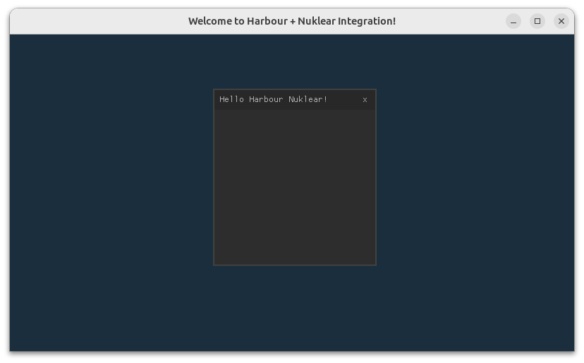

# Harbour-Nuklear

`hbnk` is a set of language bindings for Harbour, designed to integrate the [Nuklear](https://github.com/Immediate-Mode-UI/Nuklear) library.
It provides a lightweight, immediate-mode GUI toolkit, enabling Harbour developers to create modern and responsive user interfaces with ease.

### Getting Started

Installing hbnk requires Nuklear including its headers. For more info see [getting started](docs/README.md).

### Example

